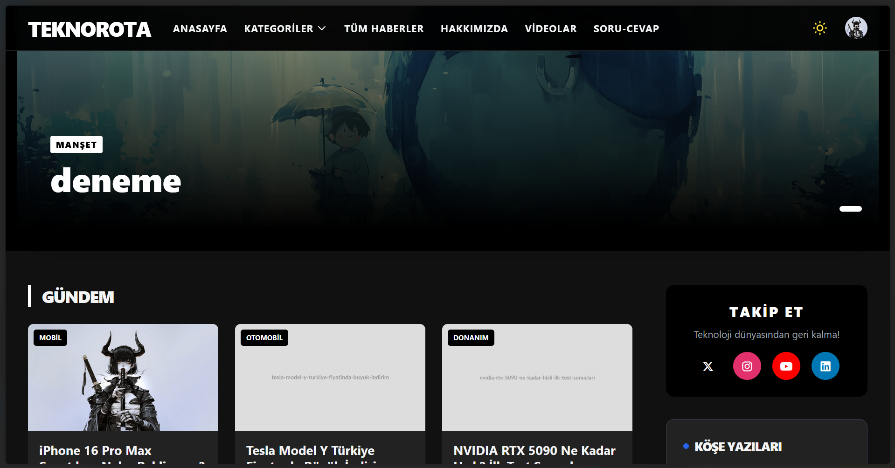
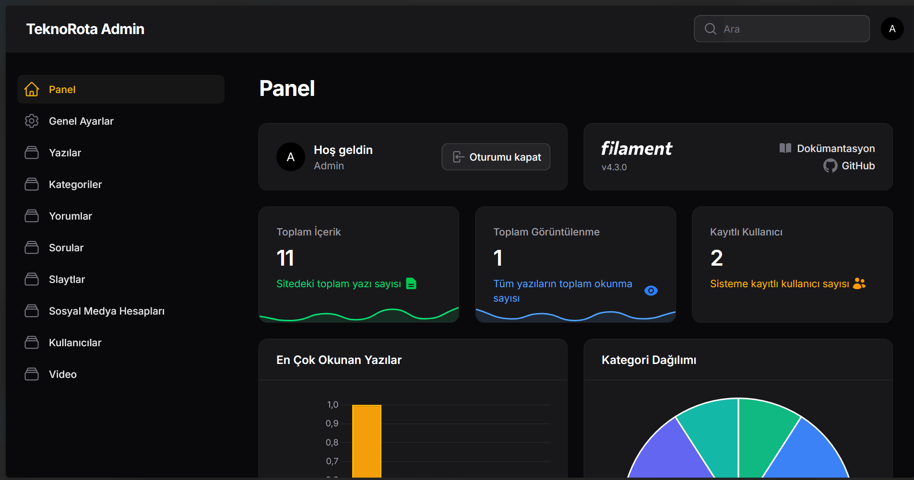
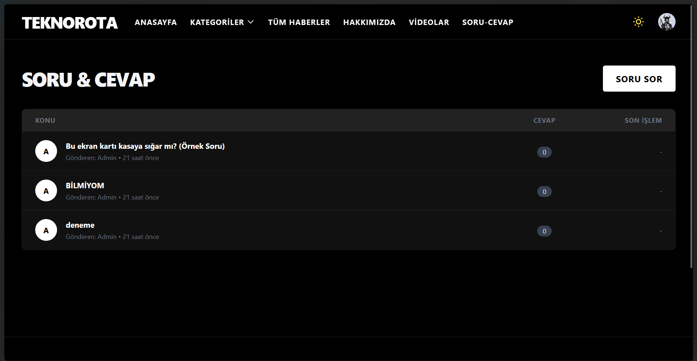

# TeknoRota -  Kapsamlı Haber ve Teknoloji Portalı Scripti

TeknoRota, Laravel 12 ve Filament PHP tabanlı, modern, hızlı ve tamamen yönetilebilir bir haber portalı altyapısıdır. Gelişmiş admin paneli, kullanıcı dostu arayüzü ve SEO uyumlu yapısıyla profesyonel yayıncılık için tasarlanmıştır.

## 🌟 Özellikler

### 🎨 Ön Yüz (Frontend)
*   **Modern Tasarım:** Tailwind CSS ve Alpine.js ile geliştirilmiş, şık ve responsive arayüz.
*   **Karanlık Mod (Dark Mode):** Otomatik cihaz tercihi algılama ve manuel geçiş butonu.
*   **Slider Manşet Sistemi:** Admin panelden yönetilebilir sürükle-bırak manşet alanı.
*   **Kategorileme:** Gündem, Teknoloji, Mobil, Yazılım gibi sınırsız kategori desteği.
*   **Yazar Köşesi:** Köşe yazarları için özel alanlar.
*   **Video Galeri:** YouTube entegrasyonlu video içerik alanı.
*   **Soru-Cevap Platformu:** Kullanıcıların soru sorup cevaplayabildiği interaktif bölüm.
*   **Yorum Sistemi:** Onay mekanizmalı, yanıt verilebilir(nested) yorum sistemi.

### ⚡ Yönetim Paneli (Admin)
*   **Filament PHP Gücü:** Hızlı, güvenli ve modern admin deneyimi.
*   **Dashboard Widget'ları:** Toplam içerik, görüntülenme sayıları, popüler içerikler ve kategori dağılımı grafikleri.
*   **Dinamik Site Ayarları:**
    *   Site Başlığı, Logo ve Favicon yükleme.
    *   Sosyal Medya linklerini (renk ve ikonlu) yönetme.
    *   "Hakkımızda" sayfasını admin panelden düzenleme (Rich Text Editor).
*   **İçerik Yönetimi:** Haber, Blog, Slayt, Yorum ve Kategori yönetimi.
*   **Kullanıcı Yönetimi:** Rol bazlı (Admin, Editör, Kullanıcı) yetkilendirme.

### 🛠 Teknik Özellikler
*   **Laravel 12 Framework**
*   **Google Login** (Laravel Socialite Entegrasyonu)
*   **SEO Optimizasyonu:** Otomatik Meta etiketleri ve Open Graph desteği.
*   **Performans:** N+1 sorgu optimizasyonu yapılmış veritabanı yapısı.

## 🚀 Kurulum

1.  **Projeyi Klonlayın:**
    ```bash
    git clone https://github.com/kullaniciadi/teknorota.git
    cd teknorota
    ```

2.  **Bağımlılıkları Yükleyin:**
    ```bash
    composer install
    npm install
    npm run build
    ```

3.  **Çevresel Değişkenleri Ayarlayın (.env):**
    ```bash
    cp .env.example .env
    ```
    .env dosyasını açın ve veritabanı bilgilerinizi girin:
    ```env
    DB_CONNECTION=mysql
    DB_HOST=127.0.0.1
    DB_PORT=3306
    DB_DATABASE=haber_portali
    DB_USERNAME=root
    DB_PASSWORD=
    ```

4.  **Anahtarı Oluşturun ve Veritabanını Hazırlayın:**
    ```bash
    php artisan key:generate
    php artisan migrate --seed
    ```
    *Not: `--seed` komutu varsayılan admin kullanıcısını, site ayarlarını ve test içeriklerini yükler.*

5.  **Storage Bağlantısını Yapın (Görseller için):**
    ```bash
    php artisan storage:link
    ```

6.  **Sunucuyu Başlatın:**
    ```bash
    php artisan serve
    ```

## 🔐 Kullanım Bilgileri

Varsayılan Yönetici Hesabı (Seeder ile gelir):
*   **E-posta:** admin@example.com
*   **Şifre:** password
*   **Panel:** `/admin`

## 📸 Ekran Görüntüleri

Projenin öne çıkan ekran görüntüleri:

### Anasayfa
*(Buraya `screenshots/home.png` ekleyin)*


### Admin Paneli - Dashboard
*(Buraya `screenshots/admin.png` ekleyin)*


### Soru-Cevap Bölümü
*(Buraya `screenshots/questions.png` ekleyin)*


## 📄 Lisans

Bu proje MIT lisansı altındadır. Dilediğiniz gibi geliştirebilir ve kullanabilirsiniz.
